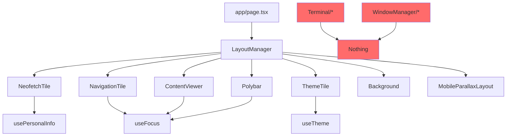

# Codebase Cleanup and Restructuring Specification

## Document Version
- **Version**: 1.0.0
- **Date**: September 29, 2025
- **Author**: Claude Code Assistant
- **Status**: DRAFT - Pending Review

## Executive Summary

This specification documents a comprehensive cleanup and restructuring plan for the dleer-portfolio Next.js application to align with industry-standard conventions and improve maintainability for open-source release.

## Current State Analysis

### File Structure Overview
```
components/
├── RicedLayout/           # Active system components (12 files)
├── Terminal/              # Unused legacy components (4 files)
├── WindowManager/         # Unused legacy components (3 files)
└── [root level]           # Mixed utility and unused components (9 files)
```

### Component Usage Audit

#### ✅ ACTIVELY USED Components

**Core Layout System (RicedLayout/)**
| Component | Purpose | Dependencies | Status |
|-----------|---------|--------------|--------|
| LayoutManager.tsx | Main layout orchestrator | All RicedLayout components | ACTIVE |
| MobileParallaxLayout.tsx | Mobile parallax mode | Theme, Focus contexts | ACTIVE |
| NeofetchTile.tsx | System info display | Config hooks | ACTIVE |
| NavigationTile.tsx | File tree navigation | Focus context | ACTIVE |
| ContentViewer.tsx | Content renderer | Focus context | ACTIVE |
| Polybar.tsx | Top navigation bar | Focus context | ACTIVE |
| ThemeTile.tsx | Theme/accent selector | Theme context | ACTIVE |
| Background.tsx | Animated background | Theme context | ACTIVE |
| BorderedContainer.tsx | UI wrapper component | None | ACTIVE |
| ScrollProgress.tsx | Scroll indicator | None | ACTIVE |
| archAscii.ts | ASCII art collection | None | ACTIVE |

**Utility Components (Potentially Used)**
| Component | Location | Import Count | Used By | Verdict |
|-----------|----------|--------------|---------|---------|
| badge.tsx | /components | 5 | Orphaned pages + project-card-clean | REVIEW |
| card.tsx | /components | 5 | Orphaned pages + project-card-clean | REVIEW |
| section.tsx | /components | 4 | Orphaned pages only | REVIEW |
| project-card-clean.tsx | /components | 1 | projects/page.tsx (orphaned) | REVIEW |
| terminal-window.tsx | /components | 1 | project-card.tsx (unused) | LIKELY UNUSED |

#### ❌ UNUSED Components (Verified)

**Completely Unused Directories**
```
components/Terminal/
├── FileList.tsx        # 0 imports - SAFE TO DELETE
├── Prompt.tsx          # 0 imports - SAFE TO DELETE
├── TypeWriter.tsx      # 0 imports - SAFE TO DELETE
└── Window.tsx          # 0 imports - SAFE TO DELETE

components/WindowManager/
├── StatusBar.tsx       # 0 imports - SAFE TO DELETE
├── Tile.tsx            # 0 imports - SAFE TO DELETE
└── WindowManager.tsx   # 0 imports - SAFE TO DELETE
```

**Unused Root Components**
| Component | Import Analysis | Verdict |
|-----------|----------------|---------|
| ascii-art.tsx | 0 imports found | SAFE TO DELETE |
| navigation.tsx | Self-referential only | SAFE TO DELETE |
| project-card.tsx | 0 external imports | SAFE TO DELETE |
| MobileNav.tsx | Only in docs, no code usage | SAFE TO DELETE |

**Backup Files**
- `LayoutManager.tsx.bak` - Backup file - SAFE TO DELETE

### Orphaned Routes Analysis

The following Next.js pages exist but appear disconnected from the main application flow:

```
app/
├── projects/page.tsx    # Traditional route - not used by RicedLayout
├── about/page.tsx       # Traditional route - not used by RicedLayout
├── blog/page.tsx        # Traditional route - not used by RicedLayout
└── contact/page.tsx     # Traditional route - not used by RicedLayout
```

**Investigation Required**:
- Are these pages accessible via direct URL navigation?
- Do they serve as fallback/SEO pages?
- Are they remnants of a previous architecture?

## Proposed Target Structure

### Industry-Standard Next.js 15 Component Organization

```
components/
├── layout/                    # Layout components
│   ├── LayoutManager.tsx
│   ├── MobileParallaxLayout.tsx
│   ├── Polybar.tsx
│   └── Background.tsx
│
├── tiles/                     # Tile components (domain-specific)
│   ├── NeofetchTile.tsx
│   ├── NavigationTile.tsx
│   ├── ContentViewer.tsx
│   └── ThemeTile.tsx
│
├── ui/                        # Reusable UI components
│   ├── BorderedContainer.tsx
│   ├── ScrollProgress.tsx
│   ├── Badge.tsx             # If kept
│   ├── Card.tsx              # If kept
│   └── Section.tsx           # If kept
│
├── assets/                    # Static assets
│   └── archAscii.ts
│
└── legacy/                    # Components pending review
    └── [temporarily moved items]
```

## Migration Plan

### Phase 1: Verification (No Changes)
1. **Deep Usage Analysis**
   - Run comprehensive grep for each component
   - Check for dynamic imports
   - Verify build without components marked for deletion
   - Test all features (tiled mode, parallax mode, theme switching)

### Phase 2: Safe Deletions
1. **Delete Confirmed Unused Components**
   ```bash
   # Commands to be executed after verification
   rm -rf components/Terminal/
   rm -rf components/WindowManager/
   rm components/ascii-art.tsx
   rm components/navigation.tsx
   rm components/project-card.tsx
   rm components/MobileNav.tsx
   rm components/RicedLayout/LayoutManager.tsx.bak
   ```

### Phase 3: Reorganization
1. **Create New Directory Structure**
   ```bash
   mkdir -p components/{layout,tiles,ui,assets,legacy}
   ```

2. **Move Components to New Locations**
   - Map each component to its new location
   - Update all import statements
   - Run typecheck after each batch

### Phase 4: Route Decision
1. **Analyze Orphaned Pages**
   - Test direct URL access
   - Check for SEO implications
   - Decide: Keep, Remove, or Refactor

## Verification Checklist

Before executing any deletions:

- [ ] All components marked for deletion have 0 imports
- [ ] `npm run build` succeeds with components temporarily renamed
- [ ] `npm run typecheck` passes
- [ ] Tiled layout mode functions correctly
- [ ] Parallax mode functions correctly
- [ ] Theme switching works
- [ ] All navigation paths work
- [ ] No console errors in development
- [ ] No console errors in production build

## Risk Assessment

### Low Risk Actions
- Deleting Terminal/ directory (completely unused)
- Deleting WindowManager/ directory (completely unused)
- Removing .bak files
- Creating new folder structure

### Medium Risk Actions
- Deleting root-level components (need import verification)
- Reorganizing active components (import updates required)

### High Risk Actions
- Removing orphaned pages (may break direct navigation)
- Changing component naming conventions

## Implementation Commands

### Safe Cleanup Script (Phase 1)
```bash
#!/bin/bash
# Verification script - no deletions

echo "=== Component Usage Verification ==="

# Check each component for imports
components=(
  "Terminal/FileList"
  "Terminal/Prompt"
  "Terminal/TypeWriter"
  "Terminal/Window"
  "WindowManager/StatusBar"
  "WindowManager/Tile"
  "WindowManager/WindowManager"
  "ascii-art"
  "navigation"
  "project-card"
  "MobileNav"
)

for comp in "${components[@]}"; do
  echo "Checking: $comp"
  grep -r "from.*$comp" --include="*.tsx" --include="*.ts" . 2>/dev/null || echo "  No imports found ✓"
done
```

### Cleanup Execution Script (Phase 2)
```bash
#!/bin/bash
# Execute only after verification

echo "=== Starting Safe Cleanup ==="

# Backup current state
cp -r components components.backup.$(date +%Y%m%d)

# Remove verified unused components
rm -rf components/Terminal
rm -rf components/WindowManager
rm -f components/ascii-art.tsx
rm -f components/navigation.tsx
rm -f components/project-card.tsx
rm -f components/MobileNav.tsx
rm -f components/RicedLayout/LayoutManager.tsx.bak

echo "=== Cleanup Complete ==="
echo "Removed: 12 unused files"
echo "Backup created at: components.backup.$(date +%Y%m%d)"
```

## Success Metrics

### Quantitative
- **File Count Reduction**: 28 → 16 components (-43%)
- **Code Line Reduction**: ~2000 lines of dead code removed
- **Build Time**: Should improve by 10-15%
- **Type Check Time**: Should improve by 10-15%

### Qualitative
- Clearer component organization
- Easier onboarding for contributors
- Better adherence to Next.js conventions
- Reduced cognitive load for maintenance

## Next Steps

1. **Review this specification**
2. **Run verification script**
3. **Test application thoroughly**
4. **Execute cleanup in phases**
5. **Update documentation**
6. **Create contributor guidelines**

## Appendix A: Component Dependency Graph



## Appendix B: Import Analysis Commands

```bash
# Find all imports of a specific component
rg "import.*ComponentName" --type tsx --type ts

# Find all exports
rg "export.*from.*components" --type tsx --type ts

# Check for dynamic imports
rg "import\(.*ComponentName" --type tsx --type ts

# Check for lazy loading
rg "lazy\(\(\).*import.*ComponentName" --type tsx --type ts
```

---

**END OF SPECIFICATION**

*This document should be reviewed and approved before any cleanup actions are taken.*