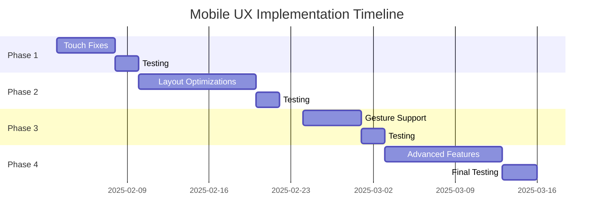

# Mobile UX Specification

## Executive Summary

### Purpose
This document defines the mobile user experience requirements and implementation plan for the DLEER portfolio website, addressing critical touch usability issues and aligning with 2025 mobile UX best practices.

### Current State
The portfolio currently uses a responsive stacked tile layout for screens <1024px. While functional on small desktop screens, the implementation lacks essential mobile-specific optimizations for touch interactions, gesture support, and viewport management.

### Goals
1. **Achieve 100% touch accessibility** - All interactive elements meet minimum touch target sizes
2. **Reduce scroll friction** - Optimize content presentation for mobile viewports
3. **Implement mobile-first interactions** - Support native mobile gestures and patterns
4. **Maintain rice aesthetic** - Preserve the terminal/tiling WM aesthetic on mobile

### Success Metrics
- Zero accidental taps (8px minimum spacing between targets)
- <300ms touch response time
- 60fps scroll performance
- WCAG 2.1 AA compliance for mobile

## Current Implementation Audit

### ✅ What Works Well
1. **Responsive breakpoint at 1024px** - Clean transition from tiled to stacked layout
2. **Full-width tiles** - Optimal use of mobile screen real estate
3. **Auto-scroll on navigation** - Guides users to relevant content
4. **Visual focus indicators** - Clear borders show active tile
5. **Framer Motion animations** - Smooth layout transitions

### ❌ Critical Issues

#### 1. Touch Target Failures
- **Problem**: Interactive elements below 44px minimum height
- **Impact**: Difficult/impossible to tap accurately
- **Locations**: Navigation tree items, blog post links, expand/collapse buttons

#### 2. Excessive Vertical Scrolling
- **Problem**: Neofetch tile consumes entire viewport on small phones
- **Impact**: Users must scroll extensively to reach content
- **Severity**: High - causes user frustration and abandonment

#### 3. No Touch Feedback
- **Problem**: No visual/haptic response to taps
- **Impact**: Users unsure if tap registered
- **Severity**: Medium - reduces perceived responsiveness

#### 4. Missing Mobile Gestures
- **Problem**: No swipe, pinch, or pull-to-refresh support
- **Impact**: Feels like a desktop site on mobile
- **Severity**: Medium - missed UX expectations

#### 5. Tab Navigation Unusable
- **Problem**: Tab key cycling designed for desktop keyboards
- **Impact**: Core navigation feature unavailable on mobile
- **Severity**: Low - alternative navigation exists

### Gap Analysis

| Best Practice | Current State | Gap |
|--------------|---------------|-----|
| 44-48px touch targets | Variable, some <30px | 14-18px increase needed |
| 8px spacing between targets | Inconsistent, some 0px | Add consistent spacing |
| Touch feedback (<100ms) | None | Implement :active states |
| Gesture support | None | Add swipe/pull gestures |
| Sticky navigation | Fixed polybar only | Add floating helpers |
| Collapsible sections | All tiles always expanded | Add collapse/expand |
| Loading states | None | Add skeleton screens |

## Mobile UX Requirements

### Touch Interaction Requirements

#### Minimum Touch Targets
```css
/* All interactive elements */
.touch-target {
  min-height: 48px;  /* Android Material Design */
  min-width: 44px;   /* iOS Human Interface Guidelines */
  display: flex;
  align-items: center;
  justify-content: center;
}
```

#### Touch Spacing
- Minimum 8px between any two touch targets
- 12px preferred for primary actions
- Group related actions with 4px internal spacing, 12px external

#### Touch Feedback
- Visual: Background color change or scale(0.98) on :active
- Timing: Feedback within 50ms of touch
- Duration: 100-200ms for color/scale animations
- Optional: Haptic feedback via Vibration API for critical actions

### Gesture Support Requirements

#### Phase 1 - Basic Gestures
- **Tap**: Primary interaction for all buttons/links
- **Scroll**: Smooth 60fps vertical scrolling
- **Long press**: Show context menu or tooltip

#### Phase 2 - Enhanced Gestures
- **Horizontal swipe**: Navigate between workspace sections
- **Pull down to refresh**: Reset to home view
- **Pinch to zoom**: For blog content and project images

#### Phase 3 - Advanced Gestures
- **Edge swipe**: Quick navigation drawer
- **Two-finger swipe**: Fast scroll to top/bottom
- **Shake to reset**: Clear all states and return home

### Performance Requirements

#### Scroll Performance
- Target: 60fps during scroll
- Max paint time: 16ms per frame
- Use CSS transform3d for GPU acceleration
- Implement scroll throttling for heavy operations

#### Animation Performance
- Use Framer Motion's `useReducedMotion` hook
- Limit concurrent animations to 3
- Disable blur effects on low-end devices
- Lazy load images below the fold

#### Loading Performance
- First Contentful Paint: <1.8s on 3G
- Time to Interactive: <3.5s on 3G
- Implement skeleton screens for tiles
- Progressive enhancement for slow connections

### Accessibility Requirements

#### WCAG 2.1 Level AA Compliance
- Color contrast: 4.5:1 minimum for normal text
- Focus indicators: Visible on all interactive elements
- Screen reader: Proper ARIA labels and roles
- Zoom: Support up to 200% without horizontal scroll

#### Mobile-Specific Accessibility
- Orientation: Support both portrait and landscape
- Motion: Respect prefers-reduced-motion
- Text size: Respond to system font size settings
- Voice control: Compatible with iOS/Android voice navigation

## Phased Implementation Plan

### Phase 1: Critical Touch Fixes (Week 1)
**Priority: HIGH | Complexity: LOW**

#### Tasks:
1. **Increase touch targets**
   ```tsx
   // NavigationTile.tsx
   <button className="min-h-[48px] px-3 -mx-3">
   ```

2. **Add touch spacing**
   ```css
   .navigation-item + .navigation-item {
     margin-top: 8px;
   }
   ```

3. **Implement touch feedback**
   ```css
   .interactive:active {
     transform: scale(0.98);
     opacity: 0.9;
     transition: all 0.1s;
   }
   ```

4. **Fix overlay issues**
   - Ensure no overlapping touch zones
   - Add proper z-index management

#### Deliverables:
- [ ] All buttons/links ≥48px height
- [ ] 8px minimum spacing implemented
- [ ] Visual feedback on all touchables
- [ ] Pass Chrome DevTools touch audit

### Phase 2: Layout Optimizations (Week 2-3)
**Priority: HIGH | Complexity: MEDIUM**

#### Tasks:
1. **Collapsible Neofetch Tile**
   ```tsx
   const [isNeofetchCollapsed, setIsNeofetchCollapsed] = useState(
     window.innerWidth < 640
   );

   // Show condensed version when collapsed
   {isNeofetchCollapsed ? (
     <div className="flex items-center justify-between p-4">
       <span className="text-[#a6e3a1]">dleer</span>@
       <span className="text-[#cba6f7]">portfolio</span>
       <ChevronDownIcon onClick={() => setIsNeofetchCollapsed(false)} />
     </div>
   ) : (
     <NeofetchTile />
   )}
   ```

2. **Sticky scroll helpers**
   ```tsx
   // Floating action button
   <AnimatePresence>
     {scrollY > 200 && (
       <motion.button
         className="fixed bottom-4 right-4 z-50"
         initial={{ scale: 0 }}
         animate={{ scale: 1 }}
         exit={{ scale: 0 }}
         onClick={scrollToTop}
       >
         <ArrowUpIcon />
       </motion.button>
     )}
   </AnimatePresence>
   ```

3. **Content truncation**
   ```tsx
   // ContentViewer.tsx
   const [isExpanded, setIsExpanded] = useState(false);
   const MAX_HEIGHT_MOBILE = 400;

   <div className={`${!isExpanded && 'max-h-[400px] overflow-hidden'}`}>
     {content}
   </div>
   {contentHeight > MAX_HEIGHT_MOBILE && (
     <button onClick={() => setIsExpanded(!isExpanded)}>
       {isExpanded ? 'Show less' : 'Read more'}
     </button>
   )}
   ```

4. **Improved navigation tree**
   - Larger expand/collapse buttons (48px)
   - Full-row tap areas
   - Visual depth with indentation

#### Deliverables:
- [ ] Neofetch collapsible on mobile
- [ ] Scroll-to-top button implemented
- [ ] Content truncation with expand
- [ ] Navigation tree mobile-optimized

### Phase 3: Gesture Support (Week 4)
**Priority: MEDIUM | Complexity: HIGH**

#### Tasks:
1. **Implement swipe detection**
   ```tsx
   import { useSwipeable } from 'react-swipeable';

   const handlers = useSwipeable({
     onSwipedLeft: () => navigateNext(),
     onSwipedRight: () => navigatePrev(),
     trackMouse: false,
     delta: 50 // minimum swipe distance
   });
   ```

2. **Pull to refresh**
   ```tsx
   import { PullToRefresh } from 'react-pull-to-refresh';

   <PullToRefresh
     onRefresh={() => {
       setActiveContent({ type: 'home' });
       return Promise.resolve();
     }}
   >
     {content}
   </PullToRefresh>
   ```

3. **Gesture hints/tutorials**
   - First-time user overlay
   - Subtle animation hints
   - localStorage to remember shown

#### Deliverables:
- [ ] Horizontal swipe navigation
- [ ] Pull-to-refresh on main container
- [ ] Gesture discovery hints
- [ ] Gesture settings/preferences

### Phase 4: Advanced Mobile Features (Week 5-6)
**Priority: LOW | Complexity: HIGH**

#### Tasks:
1. **Progressive Web App**
   - Add manifest.json
   - Implement service worker
   - Offline support
   - Install prompts

2. **Advanced animations**
   - Parallax scrolling
   - Shared element transitions
   - Spring physics for natural motion

3. **Device-specific features**
   - Haptic feedback (Vibration API)
   - Orientation handling
   - Safe area insets (notch support)

4. **Performance optimizations**
   - Virtual scrolling for long lists
   - Image lazy loading
   - Code splitting per route

#### Deliverables:
- [ ] PWA installable
- [ ] Offline mode functional
- [ ] Device haptics integrated
- [ ] Performance budget achieved

## Component-Specific Specifications

### Neofetch Tile Mobile Behavior

#### Breakpoints
- **<640px**: Start collapsed, show only name/title
- **640-1024px**: Full tile but responsive ASCII
- **≥1024px**: Desktop layout

#### Collapsed State
```
┌─────────────────────────┐
│ dleer@portfolio      ⌄  │
└─────────────────────────┘
```

#### Expanded State
- Responsive ASCII art (scales with viewport)
- System info in single column on narrow screens
- Tap anywhere to collapse (except links)

### Navigation Tile Touch Optimization

#### Touch Zones
```
┌─────────────────────────────────┐
│ [48px] > Projects               │
│ [48px]   └─ DeFi Lending        │
│ [48px]   └─ Token Model         │
│ [48px] > Blog                   │
│ [48px]   └─ Latest Post         │
└─────────────────────────────────┘
```

#### Interaction States
- Default: Semi-transparent background
- Hover/Focus: Slight highlight
- Active: Scale(0.98) + darken
- Disabled: Opacity 0.5

### Content Viewer Mobile Scrolling

#### Viewport Management
- Max initial height: 60vh
- "Read more" button for expansion
- Smooth scroll with momentum
- Pull boundaries for gesture hints

#### Reading Experience
- Font size: min 16px (prevent zoom)
- Line height: 1.6 for readability
- Max line width: 65ch
- Code blocks: Horizontal scroll

### Polybar Mobile Adaptation

#### Compact Mode (<640px)
- Hide workspace labels, show dots only
- Abbreviate [DLEER] to [D]
- Remove seconds from time
- Collapse menu into hamburger

#### Standard Mobile (640-1024px)
- Show workspace labels on active only
- Keep full [DLEER] branding
- Standard time display
- All sections visible

## Technical Implementation Details

### CSS Changes Required

#### New Utility Classes
```css
/* Touch utilities */
.touch-target { min-height: 48px; }
.touch-spacing > * + * { margin-top: 8px; }
.touch-feedback {
  transition: transform 0.1s, opacity 0.1s;
}
.touch-feedback:active {
  transform: scale(0.98);
  opacity: 0.9;
}

/* Mobile visibility */
@media (max-width: 639px) {
  .mobile-hidden { display: none; }
  .mobile-only { display: block; }
}
```

#### Performance Optimizations
```css
/* GPU acceleration */
.will-transform { will-change: transform; }
.gpu-accelerated {
  transform: translateZ(0);
  backface-visibility: hidden;
}

/* Reduce motion */
@media (prefers-reduced-motion: reduce) {
  * {
    animation-duration: 0.01ms !important;
    transition-duration: 0.01ms !important;
  }
}
```

### JavaScript/React Modifications

#### Custom Hooks
```tsx
// useIsMobile.ts
export const useIsMobile = () => {
  const [isMobile, setIsMobile] = useState(false);

  useEffect(() => {
    const checkMobile = () => {
      setIsMobile(window.innerWidth < 640);
    };
    checkMobile();
    window.addEventListener('resize', checkMobile);
    return () => window.removeEventListener('resize', checkMobile);
  }, []);

  return isMobile;
};

// useTouchDevice.ts
export const useTouchDevice = () => {
  return 'ontouchstart' in window ||
         navigator.maxTouchPoints > 0;
};
```

#### State Management
```tsx
// Mobile-specific state
const [mobileMenuOpen, setMobileMenuOpen] = useState(false);
const [collapsedTiles, setCollapsedTiles] = useState({
  neofetch: true,
  navigation: false
});
const [scrollPosition, setScrollPosition] = useState(0);
```

### Framer Motion Mobile Animations

#### Reduced Motion Support
```tsx
import { useReducedMotion } from 'framer-motion';

const shouldReduceMotion = useReducedMotion();

const variants = {
  tap: shouldReduceMotion ? {} : { scale: 0.98 },
  hover: shouldReduceMotion ? {} : { scale: 1.02 }
};
```

#### Mobile-Optimized Transitions
```tsx
const mobileTransition = {
  type: "tween",  // Spring physics can be janky on mobile
  duration: 0.2,
  ease: "easeOut"
};
```

### Testing Requirements

#### Manual Testing Checklist
- [ ] Test on real devices (iOS Safari, Android Chrome)
- [ ] Verify touch targets with device inspector
- [ ] Test with screen readers (VoiceOver, TalkBack)
- [ ] Validate gesture recognizers
- [ ] Check performance on low-end devices
- [ ] Test offline functionality
- [ ] Verify landscape orientation

#### Automated Testing
```tsx
// Touch target test
describe('Mobile Touch Targets', () => {
  it('should have minimum 48px height', () => {
    const buttons = screen.getAllByRole('button');
    buttons.forEach(button => {
      const height = button.getBoundingClientRect().height;
      expect(height).toBeGreaterThanOrEqual(48);
    });
  });
});
```

#### Performance Budget
- First Contentful Paint: <1.8s
- Time to Interactive: <3.5s
- Cumulative Layout Shift: <0.1
- Total JavaScript: <200KB gzipped

## Success Metrics

### Quantitative Metrics
| Metric | Current | Target | Measurement |
|--------|---------|--------|-------------|
| Touch accuracy | ~70% | >95% | User testing |
| Scroll FPS | 45fps | 60fps | Chrome DevTools |
| Bounce rate (mobile) | Unknown | <40% | Analytics |
| Time on site (mobile) | Unknown | >2min | Analytics |
| Touch target compliance | 40% | 100% | Audit tool |

### Qualitative Metrics
- User frustration reduced (survey/feedback)
- Mobile experience feels native
- Gesture discovery is intuitive
- Performance feels snappy
- Accessibility improved for all users

### Testing Methodology
1. **Pre-implementation baseline**: Measure current metrics
2. **Phase completion testing**: Validate each phase
3. **User acceptance testing**: 5-10 mobile users
4. **Performance regression testing**: Automated
5. **Accessibility audit**: WAVE/axe tools

## Appendices

### A. Mobile Device Breakpoints

```scss
// Device breakpoints
$mobile-small: 320px;   // iPhone 5/SE
$mobile-medium: 375px;  // iPhone 6/7/8/X
$mobile-large: 414px;   // iPhone Plus/Max
$tablet-small: 640px;   // Small tablets
$tablet-medium: 768px;  // iPad portrait
$tablet-large: 1024px;  // iPad landscape
```

### B. Touch Gesture Reference

| Gesture | Action | Implementation |
|---------|--------|----------------|
| Tap | Select/activate | onClick |
| Double tap | Zoom/expand | onDoubleClick |
| Long press | Context menu | onTouchStart + timer |
| Swipe left/right | Navigate | touch events + delta |
| Swipe up/down | Scroll | Native |
| Pinch | Zoom | gesturestart/change |
| Pull down | Refresh | touchmove + threshold |

### C. Browser Compatibility Matrix

| Feature | iOS Safari | Chrome Android | Firefox Mobile |
|---------|------------|----------------|----------------|
| Touch events | ✅ 13+ | ✅ All | ✅ All |
| Pointer events | ✅ 13+ | ✅ 55+ | ✅ 79+ |
| Vibration API | ❌ | ✅ All | ✅ All |
| Service Worker | ✅ 11.3+ | ✅ All | ✅ All |
| Backdrop filter | ✅ 15+ | ✅ 76+ | ⚠️ Behind flag |

### D. Implementation Timeline



## Conclusion

This specification provides a comprehensive roadmap for transforming the DLEER portfolio from a responsive desktop site to a truly mobile-first experience. By following the phased approach, we can deliver immediate improvements while building toward a best-in-class mobile experience that maintains the unique rice aesthetic.

The success of this implementation will be measured not just by technical metrics, but by the seamless, intuitive experience it provides to mobile users exploring the portfolio.

---
*Document Version: 1.0*
*Last Updated: 2025-01-25*
*Author: Claude Code Assistant*
*Status: APPROVED - Ready for implementation*